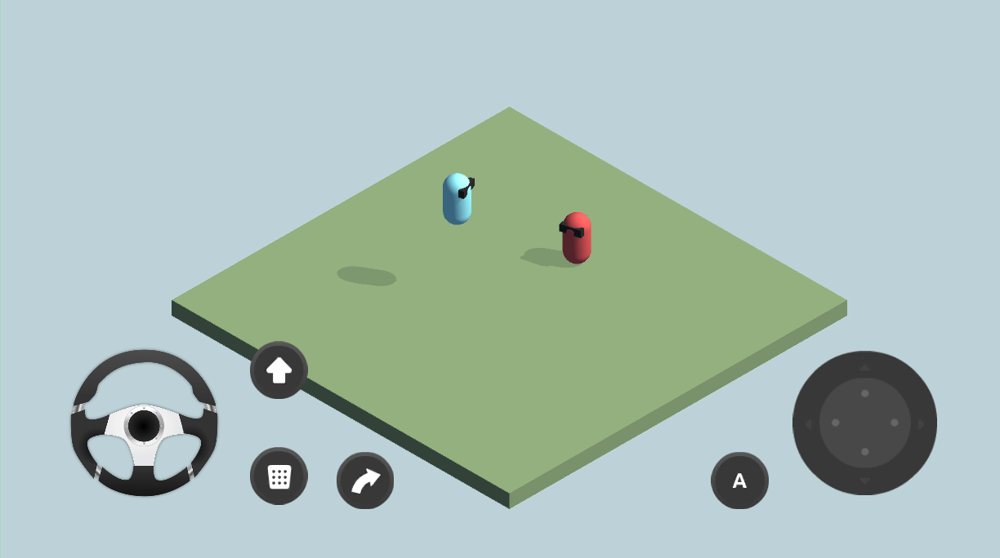

# Simple Input for Unity 3D



**Available on Asset Store:** https://assetstore.unity.com/packages/tools/input-management/simple-input-system-113033

**Forum Thread:** https://forum.unity.com/threads/simple-input-use-custom-input-providers-like-joysticks-ui-buttons-and-d-pads-open-source.520504/

**Discord:** https://discord.gg/UJJt549AaV

**WebGL Demo:** http://yasirkula.net/SimpleInputDemo/

**[GitHub Sponsors ☕](https://github.com/sponsors/yasirkula)**

SimpleInput is an improvement over Unity's standard **Input** system that allows you to use custom input providers like on-screen joysticks, UI buttons and d-pads. In other words, it lets you simulate e.g. Input.GetAxis when a button is pressed or a virtual joystick is dragged. It also supports using custom axes and buttons that don't necessarily exist in Edit-Project Settings-Input.

Please note that Unity's new Input System **is not** supported.

## INSTALLATION

There are 5 ways to install this plugin:

- import [SimpleInput.unitypackage](https://github.com/yasirkula/UnitySimpleInput/releases) via *Assets-Import Package*
- clone/[download](https://github.com/yasirkula/UnitySimpleInput/archive/master.zip) this repository and move the *Plugins* folder to your Unity project's *Assets* folder
- import it from [Asset Store](https://assetstore.unity.com/packages/tools/input-management/simple-input-system-113033)
- *(via Package Manager)* add the following line to *Packages/manifest.json*:
  - `"com.yasirkula.simpleinput": "https://github.com/yasirkula/UnitySimpleInput.git",`
- *(via [OpenUPM](https://openupm.com))* after installing [openupm-cli](https://github.com/openupm/openupm-cli), run the following command:
  - `openupm add com.yasirkula.simpleinput`

## HOW TO

To use the SimpleInput system, simply replace Input with **SimpleInput** in your scripts; i.e:

- Input.GetAxis -> SimpleInput.GetAxis
- Input.GetAxisRaw -> SimpleInput.GetAxisRaw
- Input.GetButtonDown -> SimpleInput.GetButtonDown
- Input.GetButton -> SimpleInput.GetButton
- Input.GetButtonUp -> SimpleInput.GetButtonUp
- Input.GetMouseButtonDown -> SimpleInput.GetMouseButtonDown
- Input.GetMouseButton -> SimpleInput.GetMouseButton
- Input.GetMouseButtonUp -> SimpleInput.GetMouseButtonUp
- Input.GetKeyDown -> SimpleInput.GetKeyDown
- Input.GetKey -> SimpleInput.GetKey
- Input.GetKeyUp -> SimpleInput.GetKeyUp

Note that there is no replacement for *Input.GetKey(string)* function. You have to convert the string to the corresponding **KeyCode** to benefit from *SimpleInput.GetKey(KeyCode)* function.

By default, SimpleInput receives input from Unity's Input system, as well. That's why your code keeps working as is after changing Input to SimpleInput. If you want, you can disable this behaviour so that SimpleInput receives input from custom input providers only. Simply calling `SimpleInput.TrackUnityInput = false;` will do the trick. It is possible to let a subset of the standard Unity inputs continue providing input to SimpleInput via the **UnityInputProvider** component.

SimpleInput works almost identically to standard Input system; only the lerping of Input.GetAxis might differ slightly. Lerp modifier can be configured via `SimpleInput.GetAxisSensitivity`.

## BUILT-IN INPUT COMPONENTS

### SimpleInput.GetAxis Inputs

- **AxisInputKeyboard**: provides axis input while specified key is held down
- **AxisInputMouse**: redirects "Mouse X" and "Mouse Y" inputs to two other axes on standalone platforms. Normally, on mobile platforms, dragging your finger on touchscreen provides "Mouse X" and "Mouse Y" inputs. However, you may want to simulate these two axes only with certain input method(s) on mobile platforms, e.g. a joystick. In this case, use this component to redirect mouse input to some other custom axes (like "MouseNew X", "MouseNew Y") and use these axes with SimpleInput in your scripts. Other input method(s) e.g. joystick should also use these axes instead of "Mouse X" and "Mouse Y"
- **AxisInputUI**: provides axis input while attached UI Element (anything that extends *UnityEngine.UI.Graphic*) is held down
- **AxisInputUIArrows**: provides 2-directional (left-right or up-down) or 4-directional axis input while attached UI Element is held down (see *ArrowsAllDirections*, *ArrowsHorizontal* and *ArrowsVertical* prefabs). UI Element's RectTransform must have a *Pivot* value of (0.5, 0.5)
- **AxisInputMoveGesture**: provides axis input while move gesture (two pointers moving in the same direction) is performed on a RectTransform
- **AxisInputPinchGesture**: provides axis input while pinch gesture (two pointers moving in opposite directions) is performed on a RectTransform
- **AxisInputRotateGesture**: provides axis input while rotate gesture (two pointers rotating around a center point) is performed on a RectTransform
- **AxisInputSwipeGesture**: provides axis input while a pointer is swiped by a specified amount on a RectTransform
- **Dpad**: provides -1, 0 or 1 as axis input for x and y axes while the Dpad is held down; works similar to joystick Dpads. Dpad's RectTransform must have a *Pivot* value of (0.5, 0.5)
- **Joystick**: a standard on-screen joystick input. If *Is Dynamic Joystick* is selected, joystick only appears while a pointer touches the screen. *Dynamic Joystick Movement Area* specifies the zone that the dynamic joystick can appear in (leave blank to use the whole canvas). If *Can Follow Pointer* is selected, joystick will follow the cursor when cursor's distance to the joystick is greater than the radius
- **SteeringWheel**: provides axis input while the wheel is rotated (by far, the most fun input method to play with =') ). Steering wheel's RectTransform must have a *Pivot* value of (0.5, 0.5)
- **Touchpad**: provides axis input while a pointer is dragged on a RectTransform

### SimpleInput.GetButton Inputs

- **ButtonInputKeyboard**: provides button input while specified key is held down
- **ButtonInputUI**: provides button input while attached UI Element is held down
- **ButtonInputSwipeGesture**: provides button input while a pointer is swiped by a specified amount on a RectTransform

### SimpleInput.GetMouseButton Inputs

- **MouseButtonInputKeyboard**: provides mouse button input while specified key is held down
- **MouseButtonInputUI**: provides mouse button input while attached UI Element is held down
- **MouseButtonInputSwipeGesture**: provides mouse button input while a pointer is swiped by a specified amount on a RectTransform

### SimpleInput.GetKey Inputs

- **KeyInputKeyboard**: provides key input while specified real key is held down
- **KeyInputUI**: provides key input while attached UI Element is held down
- **KeyInputSwipeGesture**: provides key input while a pointer is swiped by a specified amount on a RectTransform

To send an input while a mouse button is held down, you can use the XInputKeyboard component and set the key to the desired mouse button: *KeyCode.Mouse0*, *KeyCode.Mouse1*, etc.

**Prefabs** folder contains some plug 'n' play prefabs. Drag & drop them to your canvas and you are good to go! You can also customize them using the sprites provided in the **Sprites** folder (or using your own sprites, obviously). For more resources, open **ExtraResources.unitypackage**.

## REBINDING INPUTS

It is possible to rebind the axes, buttons, mouse buttons and/or keys in your components during gameplay. For example, if you want to change the axes of your joystick from "Horizontal" and "Vertical" to "Horizontal2" and "Vertical2", use the following code:

```csharp
void ChangeBindingsOfJoystick( Joystick joystick )
{
	joystick.xAxis.Key = "Horizontal2";
	joystick.yAxis.Key = "Vertical2";
}
```

Rebinding inputs from the Inspector is currently not possible during gameplay.

## WRITING CUSTOM INPUT PROVIDERS

Simply create a **SimpleInput.AxisInput**, **SimpleInput.ButtonInput**, **SimpleInput.MouseButtonInput** or **SimpleInput.KeyInput** object and call its **StartTracking()** function to start sending inputs to SimpleInput. Make sure to call the **StopTracking()** function before the object is destroyed or disabled. To change the value of the input, change its **value** field. See *AxisInputKeyboard.cs* and *AxisInputUI.cs* for reference.

If you need to update your input's value in *Update* function, you can register to **SimpleInput.OnUpdate** event instead of using Unity's *Update* function as SimpleInput.OnUpdate is called before other Update functions (*Script Execution Order*).

To easily simulate a button click, mouse button click or key click from your scripts, you can use the **SimpleInputHelper.TriggerButtonClick**, **SimpleInputHelper.TriggerMouseButtonClick** and **SimpleInputHelper.TriggerKeyClick** functions.
